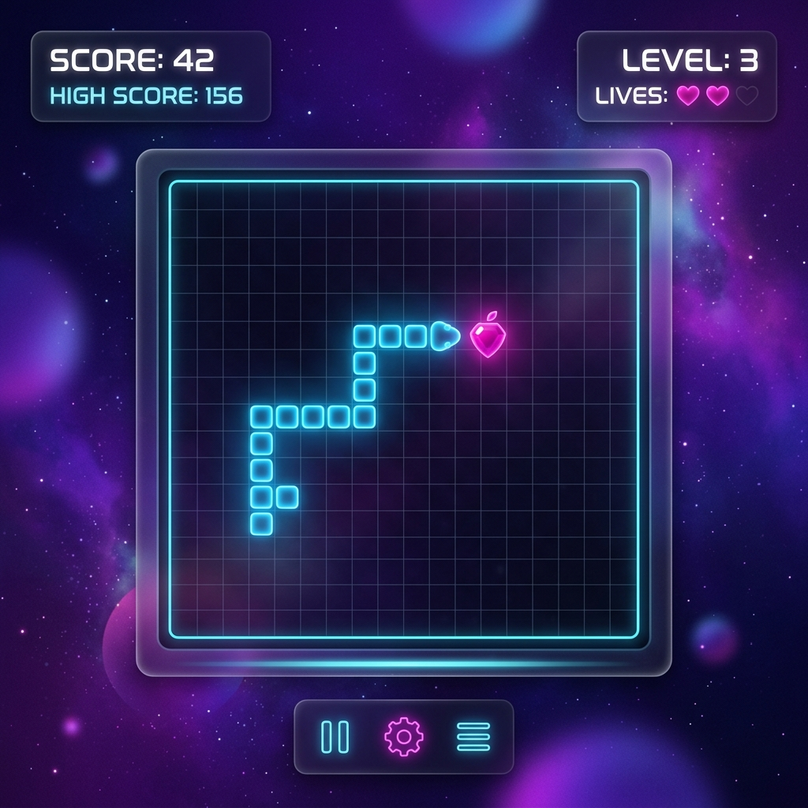

# 🐍 Neon Snake

[](LICENSE)
[](https://rajjitlai.github.io/snake-game/)

A high-performance, **Neon-Themed Snake Game** built with modern web technologies. Experience the classic arcade gameplay with a stunning "Glassmorphism" aesthetic, smooth animations, and responsive controls.



## ✨ Features

- **Premium UI**: Modern glassmorphism design with vibrant neon gradients.
- **Fluid Gameplay**: Optimized 60FPS-ready canvas rendering with motion trail effects.
- **Responsive Design**: Play on Desktop or Mobile with tactile touch controls.
- **SEO Optimized**: Meta tags and semantic HTML for better discoverability.
- **Interactive HUD**: Real-time score tracking and persistent high scores.

## 🚀 Getting Started

To run this project locally, simply clone the repository and open `index.html` in your browser.

```bash
git clone https://github.com/rajjitlai/snake-game.git
cd snake-game
# Open index.html in your preferred browser
```

## 🎮 Controls

| Action | Key | Touch Button |
| :--- | :--- | :--- |
| **Move Up** | `↑` Arrow | Up Circle |
| **Move Down** | `↓` Arrow | Down Circle |
| **Move Left** | `←` Arrow | Left Circle |
| **Move Right** | `→` Arrow | Right Circle |
| **Pause** | `Space` | - |
| **Reset** | `Esc` | - |

## 🏗️ Project Structure

```text
.
├── assets/           # Visual assets and previews
├── css/              # Core stylesheets (Glassmorphism theme)
├── js/               # Game logic and engine
├── index.html        # Main entry point
├── LICENSE           # MIT License
└── README.md         # Project documentation
```

## ⚖️ License

Distributed under the MIT License. See `LICENSE` for more information.

---
Created with ❤️ by **Rajjit Laishram**, 2026.
